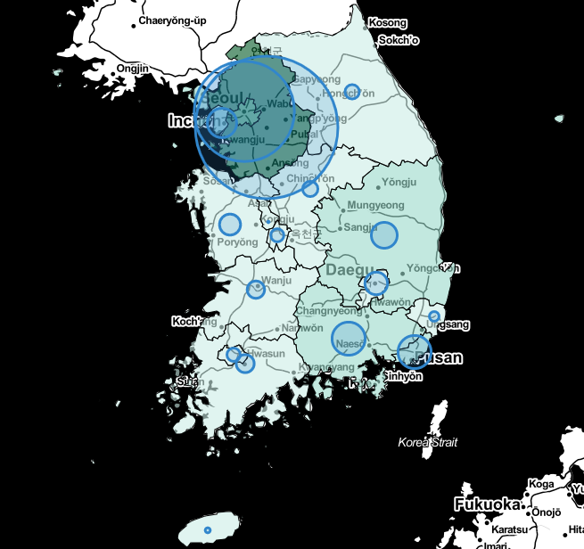

# Covid-19 Data

## Description
``` 코로나-19 바이러스에 관한 데이터 탐색 및 분석연습 ```

### Tech Stack
 

### Development Period
* 2021.03 (in class)
* -- 2022.01 changed little by little until recently

### Result
1. '백신', '코로나'로 검색한 기사 내용 word cloud

|백신|코로나|
| :-: | :-: |
|||

2. 전국 1차 백신 접종자 현황 folium


